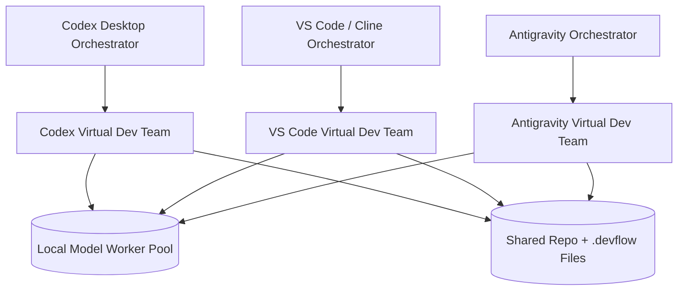

# 🌿 devflow

`devflow` is a conservative, file-based execution and coordination engine designed for AI-generated unified diffs. 

In a multi-agent development environment, different AI orchestrators (e.g. Codex Desktop, VS Code/Cline, Google Antigravity) and humans must collaborate on the same repository safely. `devflow` provides a strict safety contract that claims task files, checks git worktrees, creates recovery checkpoints, previews changes, executes local tests, automatically rolls back on failure, and compiles audit logs.

## Global Workflow Rule

For this repository's ongoing work, orchestration is peer-parallel by default.

- VS Code/Copilot, Codex Desktop, and Google Antigravity are separate first-class orchestrator lanes.
- Run many tasks in parallel by claiming different task files and branches per orchestrator.
- Each orchestrator has its own local qwen worker dev team for iterative coding, test-writing, repair loops, and summarization.
- Route all repository mutations through the `devflow` task + unified diff + verification + report contract.
- Human direction assigns or reassigns task ownership; there is no permanent default orchestrator.

---

## 🎨 Architectural Topology

`devflow` treats the repository and git history as the coordination surface. Different IDEs act as peer orchestrators rather than being locked into permanent global roles:



---

## 📈 Token Economics & Hybrid Agent Design

A standard cloud-based coding agent burns through thousands of tokens in iterative test-repair and lint-fix loops. `devflow` solves this by establishing a **hybrid execution model**:

* **Outer Loop (Strategy & Planning - Cloud)**: Premium cloud models (like Gemini or Claude) are used exclusively for high-level specification writing, task planning, and final validation report review.
* **Inner Loop (Drafting & Repair - Local)**: Locally-hosted coding models handle high-turn implementation drafting, syntax checks, import resolution, and test repair loops. On a Mac mini M1 with 16 GB RAM, the preferred quality worker is `qwen2.5-coder:14b`; use `qwen2.5-coder:7b-instruct` as the faster fallback and `qwen2.5-coder:1.5b` as the minimum baseline.

### Calculated Token Savings
For a moderate feature requiring a 5-turn test-and-repair loop:
* **Traditional Cloud Agent**: ~70,000 cloud tokens (sending the entire codebase context back and forth repeatedly).
* **devflow Hybrid Agent**: ~12,000 cloud tokens (planning + final audit review only).
* **Net Savings**: **~80% to 85% reduction in cloud token cost** per feature.

---

## 🔒 The Safety Contract

Every execution in `devflow` adheres to a strict zero-trust safety pipeline:

```text
Task markdown file
  └── 1. Clean Git Worktree Guard (Blocks if dirty to protect uncommitted code)
       └── 2. Protected Paths check (Blocks if secrets, configs, or lockfiles are touched)
            └── 3. Safe Checkpoint Branch (Creates branch backup of current state)
                 └── 4. Dry-Run validation (Checks diff structure and line counts)
                      └── 5. Gated Apply (Previews by default; requires --yes to write changes)
                           └── 6. Verification Suite (Executes configured tests and linters)
                                └── 7. Failure Classification & Rollback (Resets to checkpoint if tests fail)
                                     └── 8. Audit Report Generated (Detailed status transition and logs saved)
```

---

## 🛠️ CLI Reference

`devflow` is extremely lightweight and exposes a narrow, testable command interface.

### Workspace Commands

* **Initialize a Workspace**: Creates all folders, default `config.json`, the advisory `constitution.md`, and orchestrator templates under `.devflow/`.
  ```bash
  PYTHONPATH=src python3 -m devflow init
  ```
* **Status Summary**: Lists total count of pending, claimed, running, and completed tasks in the workspace.
  ```bash
  PYTHONPATH=src python3 -m devflow status
  ```

### Task Coordination Commands

* **Scaffold a Task**: Generates a new canonical task markdown file pre-filled with headers and standard-compliant sections.
  ```bash
  PYTHONPATH=src python3 -m devflow task new <task_id> "<task_title>" \
    --plan <plan_filename> \
    --agent <agent_name> \
    --allowed <allowed_file_or_glob> \
    --verify <verification_command>
  ```
* **Claim Task Ownership**: Locks ownership for an orchestrator to prevent collision.
  ```bash
  PYTHONPATH=src python3 -m devflow task claim .devflow/tasks/<task_file>.md \
    --agent <codex|vscode|antigravity> \
    --lock <session_lock_id> \
    --touch <expected_touched_file>
  ```
* **Release Task Ownership**: Returns a claimed task back to the shared pending queue.
  ```bash
  PYTHONPATH=src python3 -m devflow task release .devflow/tasks/<task_file>.md
  ```
* **Task Status**: Prints full coordination details, latest audit report path, allowed paths, and mirrored plan status for a task.
  ```bash
  PYTHONPATH=src python3 -m devflow task status .devflow/tasks/<task_file>.md
  ```

### Task Execution Commands

* **Dry-Run & Preview**: Validates the diff block format, checks allowed path constraints, checks protected path rules, and shift status to `PREVIEWED` without applying any code edits.
  ```bash
  PYTHONPATH=src python3 -m devflow run .devflow/tasks/<task_file>.md
  ```
* **Zero-Trust Apply**: Creates a checkpoint branch, applies the patch, executes unit verification, rolls back to clean checkpoint on failure, and compiles a comprehensive report.
  ```bash
  PYTHONPATH=src python3 -m devflow run .devflow/tasks/<task_file>.md --yes
  ```

---

## 📂 The `.devflow` Structure

```text
.devflow/
├── config.json            # Enforceable machine-readable policy (protected paths, retry budgets)
├── constitution.md        # Human-facing, advisory operating principles
├── plans/                 # Secondary plan JSON indexes (status mirrored best-effort)
├── tasks/                 # Canonical task markdown files (executable files containing diffs)
├── reports/               # Auto-generated markdown reports compiled after every run
└── orchestrators/         # Team shape specifications and local model policies
```

---

## 🚀 Environment Quickstart

1. **Prerequisites**: Ensure you have Python 3.12+ and Git installed on your system.
2. **Virtual Environment**: Set up your development virtual environment and install the package in editable mode:
   ```bash
   /opt/homebrew/bin/python3.12 -m venv .venv
   .venv/bin/python -m pip install -e .
   ```
3. **Execute Unit Tests**:
   - Via Virtual Env: `.venv/bin/python -m unittest discover -s tests -q`
   - Via Source Path: `PYTHONPATH=src python3 -m unittest discover -s tests -q`

---

## 🩺 Troubleshooting & Repairs

* **macOS startup hangs**: If Homebrew Python or portable Ruby hangs, it is typically a wedged macOS Gatekeeper daemon; run `sudo killall syspolicyd` to restart it cleanly.
* **pyexpat linkage mismatch**: If `pyexpat` fails to load, relink the extension module using `install_name_tool` to point to `/opt/homebrew/opt/expat/lib/libexpat.1.dylib`, then run `codesign --force --sign -`.
* **Editable Site-Packages hidden**: If site-packages files are hidden causing Python to skip the editable `.pth` loader, clear the flags using: `chflags -R nohidden .venv`.
