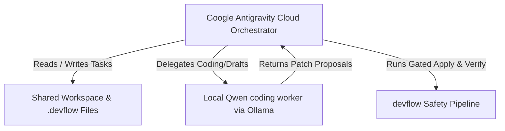

# Design Spec: Google Antigravity Setup on Mac Mini M1 (16GB)

Date: 2026-05-26
Status: DRAFT / PENDING REVIEW

## 1. Objective & Context

This document details the configuration and architectural setup for running the **Google Antigravity** peer-orchestrator lane on a **Mac Mini M1 with 16 GB RAM**. Antigravity can run in parallel with Codex and VS Code/Copilot as long as each lane claims separate tasks and touched-file scope.

To optimize token economics and performance, this machine uses a **Hybrid Execution Model**:
* **Outer Loop (Strategic Reasoning & Planning)**: Premium Google Antigravity SDK running on cloud-based Gemini models (e.g., Gemini 3.5 Flash / High).
* **Inner Loop (Drafting, Syntax checks, & Local repairs)**: Local `qwen2.5-coder:14b` coding model running via Ollama (auto-detected as the `mini` profile on this 16 GB Mac). Use `qwen2.5-coder:7b-instruct` only as the faster fallback under memory pressure.

---

## 2. System Architecture

On this Mac Mini, the system coordinates via `devflow` task files in the workspace:



### Memory & Profile Mapping (Mac Mini M1 16GB)
`devflow`'s `local_agent_runner.py` uses dynamic system memory detection:
* **System Memory**: 16 GB RAM
* **Profile Selected**: `mini`
* **Model Assigned**: `qwen2.5-coder:14b` (approx. 9.0 GB Q4_K_M model)
* **Fast Fallback**: `qwen2.5-coder:7b-instruct` (approx. 4.7 GB Q4_K_M model)
* **API Endpoint**: `http://127.0.0.1:11434`

---

## 3. Workflow Execution Lifecycle

For tasks run on this machine, Antigravity follows a zero-trust lifecycle:

1. **Preflight Health Check**: Runs `local-worker-health-check-runbook.md` to ensure Ollama is active and the `qwen2.5-coder:14b` model is loaded.
2. **Task Claim**: Locks task ownership for the machine session.
   ```bash
   PYTHONPATH=src python3 -m devflow task claim .devflow/tasks/<task_id>.md --agent antigravity --lock antigravity-mini-session
   ```
3. **Patch Generation**: The cloud orchestrator directs the local `mini` model to draft the code modifications.
4. **Dry-Run & Preview**:
   ```bash
   PYTHONPATH=src python3 -m devflow run .devflow/tasks/<task_id>.md
   ```
5. **Gated Apply & Verification**:
   ```bash
   PYTHONPATH=src python3 -m devflow run .devflow/tasks/<task_id>.md --yes
   ```
6. **Rollback & Audit Logging**: Automatic rollback to git checkpoint if verification fails; writes a markdown audit log under `.devflow/reports/`.

---

## 4. Documentation Strategy

To document everything comprehensively as requested, we will establish two new guides under `docs/workflows/`:
1. `docs/workflows/hello-peer-orchestrator-antigravity.md`: Direct onboarding and command handbook for Google Antigravity.
2. `docs/workflows/local-worker-setup-mini.md`: System configurations, memory allocations, and performance tuning for Ollama coding models on 16GB Apple Silicon hardware.

---

## 5. Verification Plan

* **Dependency Validation**: Verify python environment is initialized under `.venv` using python3.14.
* **Ollama Connection Check**: Probe `http://127.0.0.1:11434/api/tags` to verify local model availability.
* **End-to-End Suite**: Run all `devflow` test suites under python3.14.
