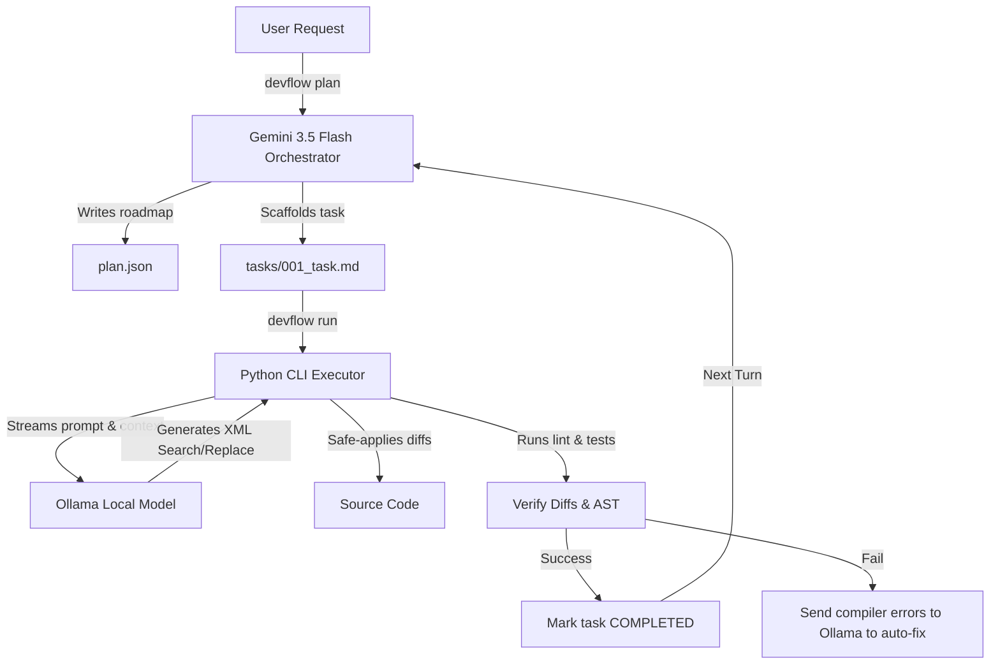

# Design Spec: devflow - "Maximum Power + Minimum Cost" Hybrid AI Developer Setup

## Executive Summary

`devflow` is a global, reusable development workflow and CLI tool optimized for a highly efficient "cloud-orchestrated, locally-executed" agentic loop. 

By leveraging **Gemini 3.5 Flash (High)** in the cloud as a low-cost, ultra-deep reasoning orchestrator, and **Ollama** running state-of-the-art coding models locally (**Qwen 2.5 Coder**), `devflow` achieves frontier-level software engineering performance at near-zero operating costs.

---

## 1. System Architecture & Directory Layout

`devflow` runs as a global Python CLI tool inside any active workspace. When initialized, it creates a control folder `.devflow/` to maintain execution state separate from git tracking.

### Workspace Footprint
```text
my-project/
├── .devflow/
│   ├── config.json         # Developer configuration (model maps, hardware profiles)
│   ├── plan.json           # Cloud-orchestrated roadmap and architectural decisions
│   ├── tasks/              # Active and completed task handoff files
│   │   ├── 001_db.md
│   │   └── 002_api.md
│   └── logs/               # Verbose local agent execution and terminal logs
```

### Config Schema (`.devflow/config.json`)
The configuration is machine-specific. It automatically profiles local resources to target the best available model.
```json
{
  "orchestrator": {
    "provider": "google",
    "model": "gemini-3.5-flash",
    "api_key_env": "GEMINI_API_KEY"
  },
  "local_agent": {
    "provider": "ollama",
    "host": "http://localhost:11434",
    "model_map": {
      "work_m4_max_64gb": "qwen2.5-coder:32b-instruct",
      "home_m1_16gb": "qwen2.5-coder:7b-instruct"
    },
    "active_profile": "work_m4_max_64gb"
  },
  "verification": {
    "run_tests_command": "pytest",
    "run_lint_command": "flake8"
  }
}
```

---

## 2. The File-Based Handoff Protocol (Data Flow)

To ensure robustness, resume-on-failure, and absolute developer visibility, the Orchestrator and the Local Agent communicate exclusively by reading and writing to Markdown files in `.devflow/tasks/`.



### Task Specification Format (`.devflow/tasks/001_task.md`)
```markdown
# Task: 001 - Create Auth Schema
Status: PENDING
Assigned To: LOCAL_AGENT_CODING
Target Files: 
- `backend/app/schemas/auth.py`

## [1. ORCHESTRATOR INSTRUCTIONS]
Create a modern Pydantic V2 login schema requiring email (validated string) and password (minimum 8 characters).

## [2. REQUIRED CONTEXT FILES]
<!-- file: backend/app/main.py -->
```python
# Context code here...
```

## [3. LOCAL AGENT WORK AREA]
<!-- Local agent output will go here in XML Search/Replace blocks -->

## [4. EXECUTION RESULTS]
<!-- CLI runner records verification logs (Pytest/Flake8) here -->
```

---

## 3. Local Coding Agent & Safe Edit Execution

### Model Optimizations
* **Work Machine (Mac Studio M4 Max - 64GB Unified Memory):**
  Runs `qwen2.5-coder:32b-instruct` or `deepseek-coder-v2:16b`. Capable of high-speed deep-context agentic reasoning.
* **Home Machine (Mac Mini M1 - 16GB Unified Memory):**
  Runs `qwen2.5-coder:7b-instruct` or `deepseek-coder-v2:16b-lite`. Highly optimized for low memory usage and fast local iteration.

### XML Search-and-Replace Protocol
To avoid the high latency and error rates of local models rewriting full files, the local agent is restricted to generating targeted search-and-replace blocks:
```xml
<search>
def old_login_schema():
    pass
</search>
<replace>
class LoginSchema(BaseModel):
    email: EmailStr
    password: str = Field(..., min_length=8)
</replace>
```

### Self-Healing Compilation Loop
If a local agent writes code that causes a compiler/syntax error, the CLI runner automatically intercepts it, rolls back the file changes, and posts the compiler traceback directly back to the local agent's prompt to heal itself:
> **Self-Healing Prompt:** "The changes you proposed to `backend/app/schemas/auth.py` resulted in a syntax error: `NameError: name 'BaseModel' is not defined`. Please rewrite your search/replace block ensuring all imports are resolved."

---

## 4. Verification Plan

### 1. Mock Validation Tests
* Create unit tests for the Python parser to verify it correctly parses XML search-and-replace blocks.
* Test standard and edge-case multi-line replacements (e.g., matching indentation, trailing whitespace).

### 2. Sandbox Integration Runs
* Initialize `devflow` inside a test project.
* Mock the Ollama server responses to verify that the CLI correctly transitions task states (`PENDING` -> `RUNNING` -> `COMPLETED`).
* Test the self-healing loop by intentionally returning bad code from the mock local agent and verifying it successfully corrects the imports.

### 3. Local Hardware Test
* Run a benchmark suite locally on the **M4 Max 64GB** to calculate the tokens-per-second and verify low thermal throttling under active Ollama load.
