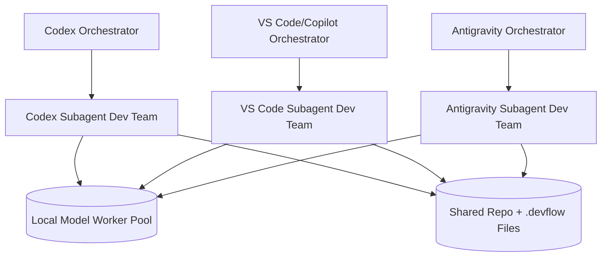

# Multi-Agent Coordination Playbook (devflow Workspace)

Date: 2026-05-26
Status: ACTIVE COORDINATION MODEL

This playbook defines collaboration for three peer IDE orchestrators: Codex Desktop, VS Code + Copilot, and Google Antigravity.

Important operating rule: no IDE is globally "the planner" and no IDE is globally "just the implementer". Each IDE runs its own full dev-team subagent stack.

---

## 1. Topology: Three Independent Orchestrators



Each orchestrator can independently do:
- strategy and decomposition
- architecture and design
- implementation via diffs
- test generation and repair
- verification and reporting

---

## 2. Standard Subagent Team Shape (Per IDE)

Every IDE orchestrator should instantiate the same internal virtual team:
1. Product/Spec Analyst
2. Technical Architect
3. Task Planner
4. Diff Implementer
5. Test Engineer
6. Verifier/Reviewer
7. Release/Report Coordinator

Execution preference:
- local models do coding and test-fix loops whenever possible
- orchestrator handles planning, policy checks, and final decisions

---

## 3. Coordination Contract Across IDEs

To avoid collisions while preserving independence:
1. Branch-per-task remains mandatory.
2. Task file ownership is explicit.
3. Any orchestrator may claim a task by setting header metadata:
   - Assigned Agent: <codex|vscode|antigravity>
   - Branch: devflow/task-<id>-<owner>
4. The claiming orchestrator owns planning, implementation, test repair, verification, rollback, and reporting for that task.
5. Other orchestrators treat claimed tasks and declared touched files as read-only unless ownership is released.
6. Cross-agent review is allowed, but review comments must not mutate the claimed task's files without handoff.

Suggested task status lifecycle:
- PENDING
- CLAIMED
- PREVIEWED
- RUNNING
- COMPLETED
- FAILED
- BLOCKED

Run contract:
- `devflow run <task>` validates the embedded unified diff, writes a PREVIEWED report/status, and does not apply code changes.
- `devflow run <task> --yes` applies the patch after validation, runs verification, and writes the final report/status.
- The git worktree must be clean before `devflow run` mutates task, report, or code state.

Recommended task header extension:

```md
Status: CLAIMED
Assigned Agent: codex
Owner Lock: codex-desktop
Branch: devflow/task-001-codex
Touched Files:
- src/devflow/cli.py
- tests/test_cli.py
```

`Assigned Agent` names the owning orchestrator. `Owner Lock` names the active IDE/session/team. `Touched Files` declares the expected edit surface so other orchestrators can avoid accidental overlap.

---

## 4. Local Model Worker Policy

Local models are shared execution workers and are not orchestrators.

Current preferred local endpoint:
- http://127.0.0.1:11434

Current model policy (profile-based):
- studio: qwen2.5-coder:32b-instruct
- mini: qwen2.5-coder:14b
- mini-fast: qwen2.5-coder:7b-instruct
- baseline: qwen2.5-coder:1.5b

Operational model rule:
- Codex is the default orchestrator lane for this workspace's goal-driven work unless human instruction delegates a specific task to another orchestrator.
- qwen local models are worker subagents (planner/coder/reviewer/tester/summarizer), not orchestrators.

Recommended scaling models (hardware dependent):
- qwen2.5-coder:7b-instruct (fast fallback)
- qwen2.5-coder:14b (preferred quality worker for Mac mini M1 16 GB)
- qwen2.5-coder:32b-instruct

All orchestrators should treat local model calls as bounded worker jobs with explicit retries and verification gates.

---

## 5. What This Playbook Replaces

Deprecated assumptions:
- Codex is always strategic planner only.
- VS Code/Copilot is always diff writer only.
- Antigravity is always auditor/executor only.

Replacement:
- All three IDEs are first-class orchestrators with full-stack subagent teams.

---

## 6. Current Leadership Mode

Codex is the default coordination lead for goal-driven work in this workspace. This does not remove peer-orchestrator capability; it defines the default lane unless the human delegates a specific task elsewhere.

Current priorities:
1. synthesis and gap analysis
2. task sequencing and ownership clarity
3. coordination and workflow documentation

Code changes in src/ and tests/ should happen only after an orchestrator claims a task or receives direct human instruction for the file scope. Task files should be committed before `devflow run` so the clean-worktree guard can protect other agents' uncommitted work.
